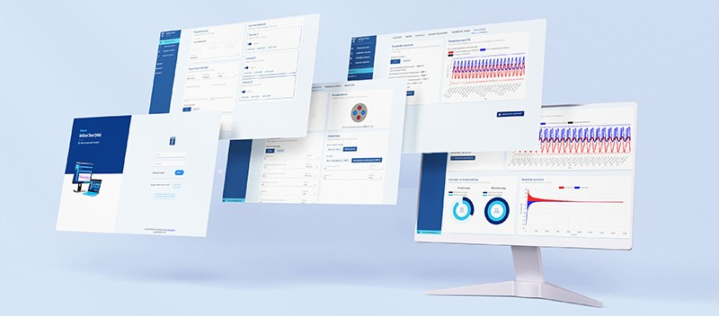

.. meta::
    :google-site-verification:
        kyNM7QCwOhYhhiMVgpGGiypcERRHnBJg69FoDxV1cLg

Welcome to GHEtool's documentation!
###################################

Dear visitor

Welcome on this ReadTheDocs for the open-source borefield sizing tool GHEtool.

Here one can find (extensive) documentation of GHEtool codebase. Please find below the content of this ReadTheDocs.

Graphical user interface
========================
There are two graphical user interfaces available which are built using GHEtool: GHEtool Cloud and GHEtool Community

GHEtool Cloud
-----------
GHEtool Cloud is the official and supported version of GHEtool which supports drilling companies, engineering firms,
architects, government organizations in their geothermal design process.
With GHEtool Cloud they can minimize the environmental and societal impact while maximizing the cost-effective
utilization of geothermal projects.
Visit our website at `https://ghetool.eu <https://ghetool.eu>`_ to learn more about GHEtool Cloud and what it can do for you.

You can find the documentation for GHEtool Cloud `here <https://manual.ghetool.eu>`_.

.. toctree::
    :caption: GHEtool
    :maxdepth: 1

    self
    sources/cite
    sources/articles
    sources/changelog
    sources/legal_notice

.. toctree::
    :caption: Code
    :maxdepth: 2

    sources/code/getting_started.md
    sources/code/functionalities.md
    sources/code/modules.md
    sources/code/examples.md
    sources/code/validation.md
    sources/code/speed_improvements.md
